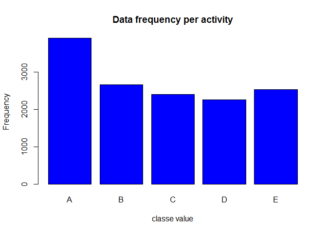

Background
----------

Using devices such as Jawbone Up, Nike FuelBand, and Fitbit it is now
possible to collect a large amount of data about personal activity
relatively inexpensively. These type of devices are part of the
quantified self movement - a group of enthusiasts who take measurements
about themselves regularly to improve their health, to find patterns in
their behavior, or because they are tech geeks. One thing that people
regularly do is quantify how much of a particular activity they do, but
they rarely quantify how well they do it. In this project, your goal
will be to use data from accelerometers on the belt, forearm, arm, and
dumbell of 6 participants. They were asked to perform barbell lifts
correctly and incorrectly in 5 different ways. More information is
available from the website here:
<http://groupware.les.inf.puc-rio.br/har> (see the section on the Weight
Lifting Exercise Dataset).

Data
----

The training data for this project are available here:

<https://d396qusza40orc.cloudfront.net/predmachlearn/pml-training.csv>

The test data are available here:

<https://d396qusza40orc.cloudfront.net/predmachlearn/pml-testing.csv>

The data for this project come from this source:
<http://groupware.les.inf.puc-rio.br/har>. If you use the document you
create for this class for any purpose please cite them as they have been
very generous in allowing their data to be used for this kind of
assignment.

Preprocessing and Loading the data
----------------------------------

After downloading the data, we have loaded the same in R .

we have removed zero divisions(Div/0) by NAs.

    training <- read.csv("pml-training.csv", na.strings=c("#DIV/0!"), row.names = 1)

    testing <- read.csv("pml-testing.csv", na.strings=c("#DIV/0!"), row.names = 1)

Checking data
-------------

First 7 variables are for auditing hence removing them from training
dataset.

    training<-training[,-c(1:7)]

Removal of near zero variables
------------------------------

It is necessary to remove the near zero or parse variables, it will
reduce the number of predictors.

    ###near zero value removal#######

    thr<-dim(training)[1]*0.95

    usfulcol<-!apply(training,2,function(x) sum(is.na(x))>thr|| sum(x=="")>thr)

    training<-training[,usfulcol]

    library(caret)

    ## Warning: package 'caret' was built under R version 3.3.3

    ## Loading required package: lattice

    ## Loading required package: ggplot2

    badCols <- nearZeroVar(training, saveMetrics = TRUE)

    training <- training[, badCols$nzv==FALSE]

Preparing Training and Validation set
-------------------------------------

Preparing the training and the validation datasets. We will use caret
package for preprocessing.

    set.seed(1234)

    inTrain<-createDataPartition(y=training$classe,p=.7,list = FALSE)

    training<-training[inTrain,]

    val<-training[-inTrain,]

Also checking the frequencies of different values of Variable Classe,
which is required to be predicted.

    plot(training$classe, col="blue", main="Data frequency per activity"
         , xlab="classe value", ylab="Frequency")

We can see Classe A is more frequent than others.

Model Selection and Validation
------------------------------

We will use rpart and Random forest and chose the best out of those two.

rpart
-----

    ###Rpart###

    library(rpart)
    training$classe<-as.factor(training$classe)

    mdrpart<-rpart(classe~.,data=training,method="class")

    confusionMatrix(predict(mdrpart,val,type="class"),val$classe)

    ## Confusion Matrix and Statistics
    ## 
    ##           Reference
    ## Prediction   A   B   C   D   E
    ##          A 990  85   4  11  41
    ##          B  33 497  36  34  44
    ##          C   8  74 533 126  75
    ##          D 116  58  32 441  66
    ##          E  29  85 106  67 533
    ## 
    ## Overall Statistics
    ##                                           
    ##                Accuracy : 0.726           
    ##                  95% CI : (0.7121, 0.7396)
    ##     No Information Rate : 0.2852          
    ##     P-Value [Acc > NIR] : < 2.2e-16       
    ##                                           
    ##                   Kappa : 0.6542          
    ##  Mcnemar's Test P-Value : < 2.2e-16       
    ## 
    ## Statistics by Class:
    ## 
    ##                      Class: A Class: B Class: C Class: D Class: E
    ## Sensitivity            0.8418   0.6220   0.7496   0.6495   0.7022
    ## Specificity            0.9522   0.9558   0.9171   0.9210   0.9147
    ## Pos Pred Value         0.8753   0.7717   0.6532   0.6185   0.6500
    ## Neg Pred Value         0.9379   0.9132   0.9462   0.9302   0.9316
    ## Prevalence             0.2852   0.1937   0.1724   0.1646   0.1840
    ## Detection Rate         0.2401   0.1205   0.1292   0.1069   0.1292
    ## Detection Prevalence   0.2742   0.1562   0.1979   0.1729   0.1988
    ## Balanced Accuracy      0.8970   0.7889   0.8334   0.7853   0.8085

Random Forest
-------------

    library(randomForest)

    ## Warning: package 'randomForest' was built under R version 3.3.3

    ## randomForest 4.6-12

    ## Type rfNews() to see new features/changes/bug fixes.

    ## 
    ## Attaching package: 'randomForest'

    ## The following object is masked from 'package:ggplot2':
    ## 
    ##     margin

    mdrf<-randomForest(classe~.,data=training,importance=TRUE,ntrees=10)

    confusionMatrix(predict(mdrf,val,type="class"),val$classe)

    ## Confusion Matrix and Statistics
    ## 
    ##           Reference
    ## Prediction    A    B    C    D    E
    ##          A 1176    0    0    0    0
    ##          B    0  799    0    0    0
    ##          C    0    0  711    0    0
    ##          D    0    0    0  679    0
    ##          E    0    0    0    0  759
    ## 
    ## Overall Statistics
    ##                                      
    ##                Accuracy : 1          
    ##                  95% CI : (0.9991, 1)
    ##     No Information Rate : 0.2852     
    ##     P-Value [Acc > NIR] : < 2.2e-16  
    ##                                      
    ##                   Kappa : 1          
    ##  Mcnemar's Test P-Value : NA         
    ## 
    ## Statistics by Class:
    ## 
    ##                      Class: A Class: B Class: C Class: D Class: E
    ## Sensitivity            1.0000   1.0000   1.0000   1.0000    1.000
    ## Specificity            1.0000   1.0000   1.0000   1.0000    1.000
    ## Pos Pred Value         1.0000   1.0000   1.0000   1.0000    1.000
    ## Neg Pred Value         1.0000   1.0000   1.0000   1.0000    1.000
    ## Prevalence             0.2852   0.1937   0.1724   0.1646    0.184
    ## Detection Rate         0.2852   0.1937   0.1724   0.1646    0.184
    ## Detection Prevalence   0.2852   0.1937   0.1724   0.1646    0.184
    ## Balanced Accuracy      1.0000   1.0000   1.0000   1.0000    1.000

Conclusion
----------

It is clear from the outcome of the Confusion Matrix that the accuracy
of Random forest is much greater than that of Rpart.So we will
considering Random Forest over Rpart while predicting the outcome of
test set.

Predicting Test set
-------------------

Now let us predict the test set.

    library(caret)

    testpredict<-predict(mdrf,testing,type="class")

    testpredict

    ##  1  2  3  4  5  6  7  8  9 10 11 12 13 14 15 16 17 18 19 20 
    ##  B  A  B  A  A  E  D  B  A  A  B  C  B  A  E  E  A  B  B  B 
    ## Levels: A B C D E
